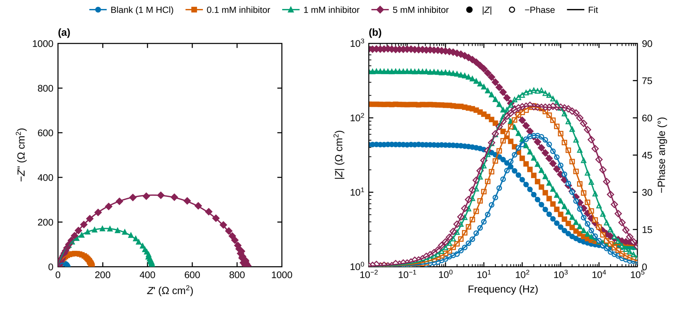
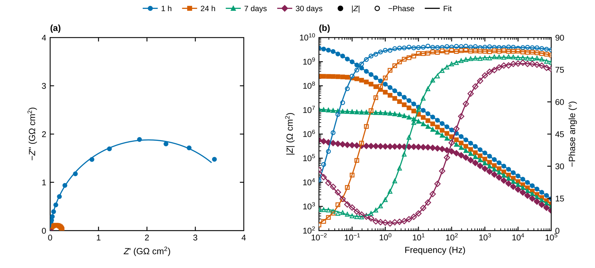

# Gamry EIS Toolkit

**[Srpski uputstvo: README.sr.md](README.sr.md)**

Turn Gamry potentiostat `.DTA` impedance files into publication-ready results in one command:

1. **Excel export** of every measured system, named the way you want
2. **Equivalent circuit fitting** with the circuit you choose (per system if needed)
3. **Nyquist and Bode figures** built to Elsevier / *Corrosion Science* artwork standards
4. **Results table** in Excel, CSV and a manuscript-ready Word table



*Example output from the simulated data in `examples/inhibitor/` (mild steel in 1 M HCl with an inhibitor). A second example, `examples/coating/`, covers epoxy-coated steel over 30 days of immersion.*

---

## What the figures do

| Requirement | How it is handled |
|---|---|
| Nyquist in orthonormal scale | Equal aspect ratio, identical limits and tick spacing on both axes, so semicircles look like true semicircles |
| Bode modulus and phase on one graph | log \|Z\| on the left axis (filled markers), −phase on the right axis (open markers) |
| Same colour per sample everywhere | Each system keeps one colour and one marker shape across Nyquist, Bode and the combined figure |
| Asks for legend text | The program asks for each legend label when it runs (press Enter to keep the default) |
| Fit lines on the plots | Solid line in the sample colour over the fitted frequency range |
| Table | `EIS_results.xlsx` (sheet *Fit results*), `fit_results.csv`, `fit_table.docx` |
| Journal standard | exactly 90 mm (single column) or 190 mm (double column) wide, Arial 8 pt, inward ticks, embedded fonts in PDF, 1000 dpi RGB TIFF (LZW), colour-blind-safe palette with distinct marker shapes so figures also work in greyscale |

## Get the code

**Without git (easiest):** on the GitHub page click the green **Code** button, then **Download ZIP**. Unzip it anywhere, for example in Documents. The folder will be called `gamry-eis-toolkit-main`.

**With git:**

```bash
git clone https://github.com/Joe-Mez/gamry-eis-toolkit.git
```

## Install Python (once)

If you already have **Anaconda** or **Miniconda**, skip this step. Otherwise install [Miniconda](https://docs.conda.io/en/latest/miniconda.html) with the default options.

You do not need to install anything else by hand. The first time you double-click `run_eis.bat`, it finds conda and creates a Python environment called `gamry-eis` with everything the toolkit needs. That takes a few minutes and needs internet. After that it starts in seconds.

To set it up by hand instead:

```bash
conda env create -f environment.yml      # creates the "gamry-eis" environment
conda activate gamry-eis
```

or, without conda: `pip install -r requirements.txt`

## Use

### Windows, no command line

1. Copy your `.DTA` files into the `data` folder.
2. Double-click `run_eis.bat`. The first time, it sets up Python (see above), creates `config.yaml` and opens it in Notepad.
3. In `config.yaml`, give each system a name and legend and set the equivalent circuit. Save and close Notepad.
4. Double-click `run_eis.bat` again. It asks for the legend text, fits, and writes everything to `results/`.

> Windows may show a blue "Windows protected your PC" box the first time, because the file was downloaded from the internet. Click **More info**, then **Run anyway**.

### Command line

```bash
python run_eis.py --init          # scan data/ and create config.yaml
python run_eis.py                 # full run: asks for legends, fits, plots, tables
python run_eis.py --no-ask        # reuse the last legend text, no questions
python run_eis.py --convert-only  # only DTA -> Excel
python run_eis.py --no-fit        # plots and Excel without fitting
python run_eis.py --elements      # list circuit elements
```

Try it on the example data first:

```bash
cd examples/inhibitor        # or examples/coating
python ../../run_eis.py
```

| Example | What it shows |
|---|---|
| `examples/inhibitor/` | Mild steel in 1 M HCl, blank and three inhibitor concentrations. Low impedance (Ω cm²), 1 cm² electrode, one file with decimal commas, one system with two time constants |
| `examples/coating/` | Epoxy-coated steel in 3.5 % NaCl after 1 h, 24 h, 7 days and 30 days. High impedance (up to GΩ cm²), 3.14 cm² electrode, a second time constant that appears as the coating degrades, and several Gamry file variants (UTF-8, galvanostatic EIS, no OCV block, spaces in the file name) |

Both are simulated with `examples/make_example_data.py`, not measured.



## Output

```
results/
├── EIS_results.xlsx       Fit results | All systems | one sheet per system | Info
├── fit_results.csv        same fit table as CSV
├── fit_table.docx         three-line journal table with units and sub/superscripts
├── fit_report.txt         fitted values with relative errors and χ²
├── legend_labels.yaml     the legend text you typed (remembered for the next run)
└── figures/
    ├── Nyquist.pdf/.tiff/.png          all systems, 90 mm
    ├── Nyquist_zoom.pdf/.tiff/.png     only when one system is >10x larger than the rest
    ├── Bode.pdf/.tiff/.png             all systems, 90 mm
    ├── EIS_combined.pdf/.tiff/.png     (a) Nyquist (b) Bode, 190 mm
    └── individual/                     one Nyquist and one Bode per system
```

Each per-system Excel sheet holds frequency, Z′, Z″, |Z|, phase, the area-normalised values, the fitted curve at the measured frequencies and the residuals in %.

## Equivalent circuits

Write circuits with `-` for series and `p(a,b)` for parallel. Nesting is allowed.

| Element | Meaning | Fitted parameters |
|---|---|---|
| `R` | resistor | `R1` |
| `C` | capacitor | `C1` |
| `L` | inductor | `L1` |
| `CPE` or `Q` | constant phase element, Z = 1 / (Q (jω)ⁿ) | `CPE1_Q`, `CPE1_n` |
| `W` | semi-infinite Warburg, Z = σ(1 − j)/√ω | `W1` (σ) |
| `Ws` | finite Warburg, transmissive | `Ws1_R`, `Ws1_T` |
| `Wo` | finite Warburg, reflective | `Wo1_R`, `Wo1_T` |

Common circuits:

| Circuit | Use |
|---|---|
| `R0-p(R1,CPE1)` | one time constant (Randles with CPE) |
| `R0-p(CPE2,R2-p(R1,CPE1))` | film or coating plus charge transfer (two time constants, nested) |
| `R0-p(R1,CPE1)-p(R2,CPE2)` | two time constants in series |
| `R0-p(CPE1,R1-W1)` | charge transfer with diffusion |

Each element name becomes one column in the results table, so give the same physical element the same name in every circuit (for example, always `R1` for charge transfer resistance). Use `parameter_labels` in `config.yaml` to print `R_ct`, `Q_dl` and so on in the Word table.

### Fitting details

* Complex non-linear least squares (SciPy `least_squares`, trust region) on real and imaginary parts together
* **Modulus weighting** by default: each point is weighted by 1/|Z| of the measured data, so every decade of frequency counts equally. `proportional` (Z′ and Z″ weighted separately, floored at 5 % of |Z|) and `unit` are also available
* Positive parameters are fitted in log space and CPE exponents are bounded to 0 ≤ n ≤ 1
* Starting values are estimated from the spectrum, then 40 random restarts are tried to avoid local minima. You can set `initial_guess` or `fixed` values per system
* Reported errors are 1σ standard errors from the Jacobian, given as % of the value. χ² is the weighted sum of squares divided by the degrees of freedom
* Parameters the data cannot determine (for example two resistors in series, or an element whose time constant lies outside the measured frequency range) are detected from the Jacobian and reported as **not determined** (± ∞, "n.d." in the Word table) instead of with a misleadingly small error
* A warning is printed when any parameter is not determined, hits the search limit or has an error above 50 %. That usually means the circuit has more elements than the data can support

## Area normalisation

`area_cm2: auto` reads the electrode area stored in each DTA file and reports impedance in Ω cm². Gamry stores 1 cm² unless you entered the real area during the measurement, so **check the area printed at the start of each run**. Set a number (e.g. `area_cm2: 0.785`) to override, per system if needed, or `none` to work in Ω.

## Input formats

* Gamry `.DTA` (EISPOT, EISGALV and other experiments with a `ZCURVE` table). Decimal commas from European Windows settings are handled
* Simple `.csv`, `.txt` or `.xlsx` tables with three columns: frequency, Z′, Z″

## Using it with Claude Code

`CLAUDE.md` tells Claude Code how to drive this toolkit. Open the folder in Claude Code and ask, for example, *"Fit my DTA files with R0-p(R1,CPE1) and make the Nyquist and Bode plots"*. Claude will ask for system names and legend text and then run the tool.

## Tests

```bash
pip install pytest
python -m pytest
```

The tests include a real Gamry file from the [impedance.py](https://github.com/ECSHackWeek/impedance.py) project and check that the fitter recovers known parameters from noisy synthetic spectra.

## Licence

MIT
